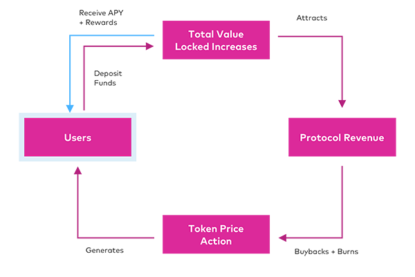

# About Oh! Finance

## Yield Index

Earn more with your DeFi Dollar by using a Yield Index. Deposit stablecoins and gain yield-generating exposure to multiple DeFi Protocols. Minimal gas fees and automatic compounding.



## Governance

Oh! Finance is a fully decentralized protocol, where users democratically vote on and agree to protocol updates and modifications.



## Profit Share

Oh! Finance is designed to bring value back to the protocol through Profit Share. **20%** of protocol profits are retained to buyback and burn the Oh! Finance Token.



