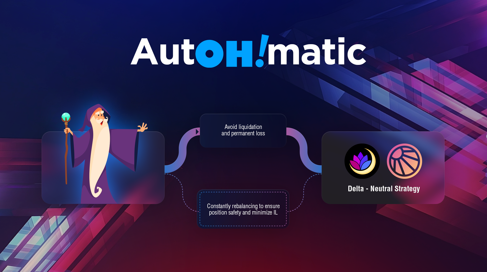

# AutOH!matic

## Automated delta neutral strategy

Oh Finance has created a Single-Asset Yield Farming Strategy where users deposit and yield farm their USDC on various chains such as MOVR. The strategy optimizes a percent of the vault holdings to lend and borrow a secondary token to create a hedged liquidity pair position. Compounding is then automated to yield farm rewards in the form of various tokens such as MOVR, SOLAR and MFAM all while minimizing risk of exposure to impermanent loss due to high volatility and getting liquidated as a result of leveraging the USDC.

<figure><figcaption>
Strategy mechanism
</figcaption></figure>

## Rebalancing

Our delta neutral vaults are managed by keepers which regularly harvest rewards all while constantly checking the health of our loans ensuring the collateral ratios don’t go above or below the thresholds set. We also minimize impermanent loss by keeping track of price delta movements to ensure we don’t experience a liquidation event. What separates us from regular delta neutral vaults is the logic for checking loan health and handling impermanent loss is calculated completely on chain ensuring maximum security and safety.

<figure><figcaption>
Rebalancing mechanism
</figcaption></figure>

### Strategy

`AutOH!matic` - Collateralize USDC and borrow MOVR from Moonwell, add USDC-MOVR liquidity to Solarbeam, earn APY in SOLAR, MOVR, and MFAM

* `underlying` - USDC
* `derivative` - USDC-MOVR SLP (Solarbeam)
* `reward` - SOLAR
* `secondaryReward` - MFAM
